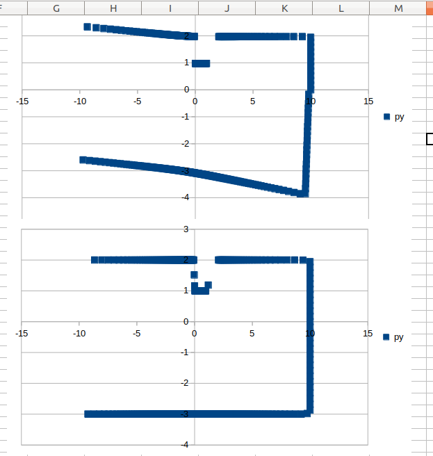

**Dewarp**
 
_Brian Erickson_

Lidar scans from a moving robot warp the world geometry causing problems for scan matching and map construction.

This project demonstrates a method to fix warped scans. By knowing the robot's linear and angular velocities a scan similar to what would be seen if the robot were standing still can be synthesized.

Here is the output of warping and dewarping a world with straight lines.

**Hacking**

This requires Eigen 3.3.4. 

Place a copy of Eigen in  /usr/local/include/eigen3.3.4

This can be built and compiled using Visual Studio Code.  

I use these plugins:
- ms-vscode.cpptools
- vector-of-bool.cmake-tools
- yzhang.markdown-all-in-one

I've only tried it with GCC 5.4.1 / linux and it probably needs modifications to work in other environments.

